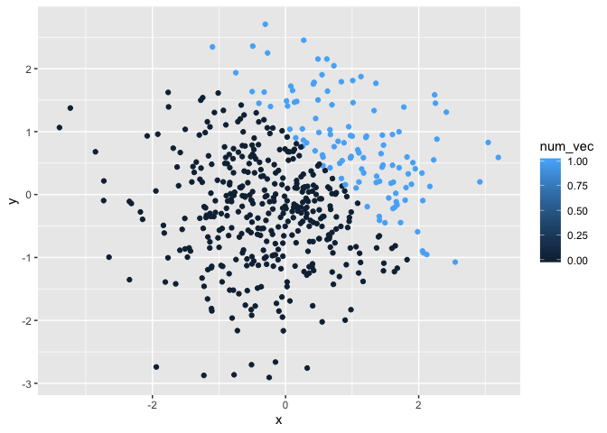
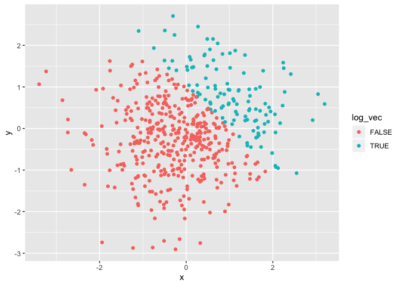

p8105 Homework Assignment 1
================
Dionna Attinson
9/18/2019

# Problem 1

#### First, we will create a data frame comprised of: a random sample of size 8 from a standard Normal distribution, a logical vector indicating whether elements of the sample are greater than 0, a character vector of length 8, and a factor vector of length 8, with 3 different factor “levels.”

``` r
la_df = tibble(
  norm_samp = rnorm(8),
  norm_samp_pos = norm_samp > 0,
  vec_char = c("D", "N", "A", "T","T","I","N","S"),
  vec_factor = factor(c("BLACK", "BLACK", "BLACK", "WHITE", "WHITE", "WHITE","OTHER","OTHER"))
)
mean(pull(la_df, norm_samp))
```

    ## [1] -0.0653452

``` r
mean(pull(la_df, norm_samp_pos))
```

    ## [1] 0.5

``` r
mean(pull(la_df, vec_char))
```

    ## Warning in mean.default(pull(la_df, vec_char)): argument is not numeric or
    ## logical: returning NA

    ## [1] NA

``` r
mean(pull(la_df, vec_factor))
```

    ## Warning in mean.default(pull(la_df, vec_factor)): argument is not numeric
    ## or logical: returning NA

    ## [1] NA

#### The mean for variables norm\_samp and norm\_samp\_pos have the ability to be calculated. However, the mean for vector characters and vector factors are unable to be calculated.

``` r
  mean(as.numeric(pull(la_df,norm_samp_pos)))
  mean(as.numeric(pull(la_df,vec_char)))
```

    ## Warning in mean(as.numeric(pull(la_df, vec_char))): NAs introduced by
    ## coercion

``` r
  mean(as.numeric(pull(la_df,vec_factor)))
```

#### When applying the as.numeric function to the logical, character, and factor variables, the mean was able to be calculated for the logical and factor variables but not the character variables because they do not have assigned numeric values.

``` r
  pull(la_df,norm_samp)*(as.numeric(pull(la_df,norm_samp_pos)))
```

    ## [1] 1.5413486 0.0000000 1.6262702 0.5036677 0.0000000 0.9553454 0.0000000
    ## [8] 0.0000000

``` r
  pull(la_df,norm_samp)*(as.factor(pull(la_df,norm_samp_pos)))
```

    ## Warning in Ops.factor(pull(la_df, norm_samp), (as.factor(pull(la_df,
    ## norm_samp_pos)))): '*' not meaningful for factors

    ## [1] NA NA NA NA NA NA NA NA

``` r
  pull(la_df,norm_samp)*(as.numeric(as.factor(pull(la_df,norm_samp_pos))))
```

    ## [1]  3.0826972 -0.7663808  3.2525404  1.0073354 -2.1111443  1.9106907
    ## [7] -0.9520715 -1.3197969

# Problem 2

#### Now, we will create a data frame comprised of: a random sample of size 500 from a standard Normal distribution, a random sample of size 500 from a standard Normal distribution, a logical vector indicating whether x + y \> 1, numeric vector created by coercing the above logical vector, and a factor vector created by coercing the logical vector.

``` r
set.seed(1234)

p2_df = tibble(
  x = rnorm(500),
  y = rnorm(500),
  log_vec = x + y > 1 ,
)
  num_vec = as.numeric(pull(p2_df, log_vec))
  fac_vec = as.factor(pull(p2_df, log_vec))
```

The data set `p2_df` has 500 rows and 3 columns.

  - The mean of the sample is 0.0018388.
  - The median of the sample is -0.0207073.
  - The standard deviation of the sample is 1.0348139.
  - The proportion of cases for which x + y \> 1 is
0.232

#### Next we show a scatterplot of `y` vs `x` using the logical variable, numeric, and factor variable, respectively.

``` r
# In the first scatterplot, x + y > 1 is our logical variable, represented by the legend, True (blue) and False (pink). True values represent the values when x + y is greater than 1, whereas the False values represent when x + y is not greater than 1. 

ggplot(p2_df, aes(x = x, y = y, color=log_vec)) + geom_point() 
```

<!-- -->

``` r
# In the second scatterplot, we transformed our logical variable into a numeric value. A scale represents that 0 (dark blue) is equal to false (x + y > 1 is FALSE) and 1 (light blue) is equal to true (x+y >1 is TRUE).

ggplot(p2_df, aes(x = x, y = y, color=num_vec)) + geom_point() 
```

<!-- -->

``` r
# In the third scatterplot, we transformed our logical variable into a factor value. True (blue) and False (pink). True values represent the values when x + y is greater than 1, whereas the False values represent when x + y is not greater than 1. 

ggplot(p2_df, aes(x = x, y = y, color=fac_vec)) + geom_point()
```

<!-- -->

``` r
# Now, we export the first scatterplot to my project directory using ggsave.
ggplot(p2_df, aes(x = x, y = y, color=log_vec)) + geom_point() 
```

<!-- -->

``` r
ggsave("scatter_plot.pdf",height = 4, width = 6)
```
